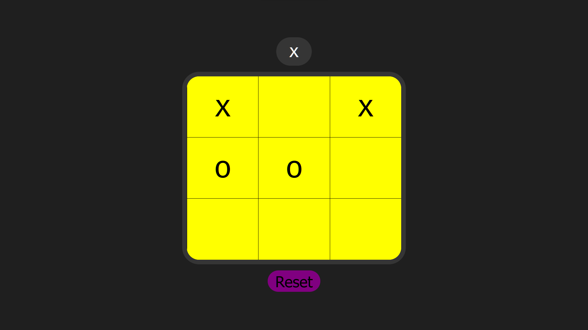

# Tic-Tac-Toe Game



Welcome to my Tic-Tac-Toe game! This simple web-based game is built using HTML, CSS, JavaScript, and Sass. It's a classic two-player game where you can challenge a friend and see who can align three of their symbols (X or O) in a row, column, or diagonal first.

## Live Demo

You can play the game right now by visiting the following link:
[Play Tic-Tac-Toe](https://yossefelnajjar.github.io/xo-game/)

## Features

- **Two-Player Mode**: Challenge a friend and take turns to make your moves.
- **Interactive**: Click on the cells to place your symbol (X or O).
- **Winning Logic**: The game checks for winning conditions and displays the winner when someone has three in a row.
- **Reset**: You can reset the game at any time to start over.
- **Responsive**: The game is responsive and can be played on both desktop and mobile devices.

## Technologies Used

- **HTML**: The structure of the game.
- **CSS**: Styles and layout.
- **JavaScript**: Game logic and interactivity.
- **Sass**: Enhances CSS for maintainability.
- **GitHub Pages**: Hosting the live demo.

## Installation

If you want to run this game locally, you can follow these steps:

1. Clone this repository to your local machine using the following command:

   ```bash
   git clone https://github.com/yossefelnajjar/xo-game.git
   ```

2. Open the project folder in your code editor.

3. Simply open the `index.html` file in your web browser to start playing.

## How to Play

1. Open the game using the provided [live link](https://yossefelnajjar.github.io/xo-game/).

2. Player 1 starts with "X." Click on an empty cell to place your symbol.

3. Player 2 follows with "O," taking turns to make moves.

4. Continue playing until one player wins by aligning three of their symbols in a row, column, or diagonal, or the game ends in a draw.

5. To restart the game at any time, click the "Restart" button.

## Contributing

If you'd like to contribute to this project, please feel free to fork the repository, make improvements, and create a pull request. Any contributions are welcome!

## Acknowledgments

- Special thanks to anyone who played and provided feedback for this game!

Enjoy playing Tic-Tac-Toe! If you encounter any issues or have suggestions for improvements, please don't hesitate to [create an issue](https://github.com/yossefelnajjar/xo-game/issues) or reach out. Have fun!
